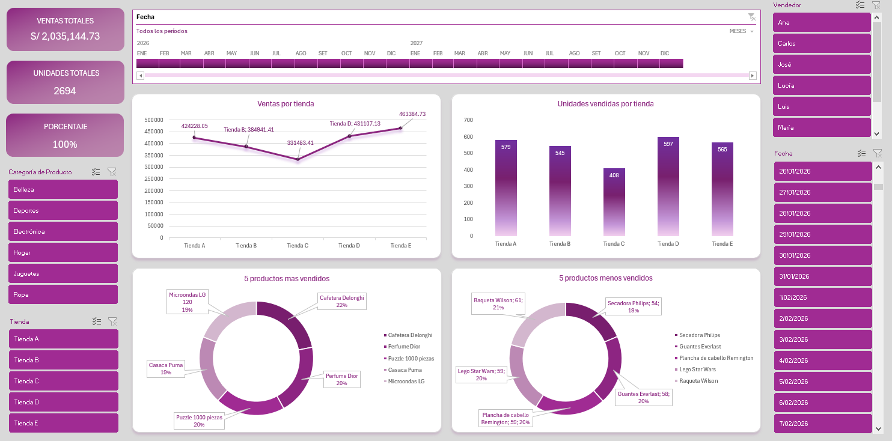

# Panel de Análisis de Ventas por Tienda y Categoría - Dashboard Interactivo
## Descripción General 
Este repositorio contiene un panel de análisis de ventas interactivo desarrollado en MS Excel. El dashboard está diseñado para monitorear y analizar el rendimiento comercial de múltiples tiendas a través de indicadores clave de rendimiento (KPIs), ventas por categoría de producto, y un ranking detallado de productos. La herramienta permite obtener una visión clara y rápida del desempeño general, identificar productos estrella y detectar oportunidades de mejora.



## Características Principales
- **Indicadores KPI:** Visualización clara de las Ventas Totales (S/ 2.03M), Unidades Vendidas (2694) y el Porcentaje de cumplimiento (100%).
- **Análisis por Tienda:** Comparativa de ventas y unidades vendidas por cada tienda (A, B, C, D, E) para identificar rápidamente a los mejores y peores performers.
- **Análisis por Categoría:** Segmentación de las ventas por categorías de tipos de productos.
- **Ranking de Productos:** Listados dinámicos de los "5 productos más vendidos" y los "5 productos menos vendidos", con sus respectivas cantidades y porcentajes de contribución.
- **Filtro Temporal:** Se tiene un segmentador de fechas que permite visualizar el rendimiento para "Todos los periodos" o filtrar por meses específicos del año 2026, facilitando el análisis de tendencias.

## Objetivo del Proyecto
Desarrollar una solución de Business Intelligence (BI) en Excel que transforme datos de ventas en información accionable, permitiendo a los equipos comerciales y de gestión tomar decisiones basadas en datos para optimizar el rendimiento de las tiendas y la gestión del inventario.

## Objetivos del Proyecto
- **Recopilación y Preparación de Datos:** Integrar datos de ventas de múltiples tiendas (Tienda A a E) y categorías en un solo modelo de datos. Limpiar y estructurar la información para asegurar la precisión de los análisis.
- **Análisis de Datos:** Calcular métricas clave como ventas totales, unidades vendidas y porcentajes de contribución. Identificar patrones de venta por tienda, categoría y producto.
- **Visualización y Dashboard:** Construir un dashboard interactivo con gráficos y tablas que resuman el rendimiento general, permitan la comparación entre tiendas y destaquen los productos con mejor y peor desempeño.
- **Insights y Recomendaciones:** Proveer una herramienta que facilite la generación de insights, como la detección de tiendas con bajo rendimiento o productos con alta demanda, para fundamentar estrategias comerciales.

## Insights Clave para el Negocio

- **Alta Concentración de Ingresos:** Las Tiendas A, D y E generan la gran mayoría de los ingresos (S/ 1.31M+). **Tienda B y C presentan una contribución mínima o nula**, lo que representa una oportunidad crítica de análisis para entender las causas: bajo tráfico, falta de stock, mala ubicación o nula operación comercial.
- **Análisis de Portafolio:** Comparar los **5 productos más vendidos** con los **5 productos menos vendidos** es vital, se pueden identificar productos que tienen bajo rendimiento podrían ser candidatos a descontinuación, relanzamiento con descuento, o mejora en su exhibición.
- **Rendimiento por Vendedor:** Gracias al segmentador de vendedor, es posible analizar el desempeño individual de cada vendedor y comparar su contribución a las ventas totales por tienda y categoría.

## Pasos Involucrados
1. **Recopilación y Preparación de Datos:** Se consolidaron los datos de ventas de las diferentes tiendas en una sola hoja de cálculo. Se realizó una limpieza básica para asegurar la consistencia de nombres de tiendas, vendedores, productos y categorías.
2. **Análisis de Datos con Excel:** Se utilizaron funciones como `SUMAR.SI.CONJUNTO` y `CONTAR.SI.CONJUNTO` para calcular los KPIs. Se crearon tablas dinámicas para resumir las ventas por tienda y categoría, así como para generar los rankings de productos (más y menos vendidos).
3. **Visualización y Creación del Dashboard:** Se diseñó la interfaz del dashboard conectándola a las tablas dinámicas. Se insertaron **múltiples segmentadores de datos (escala de tiempo, categoría de producto, tienda, vendedor, fechas de ventas)** para hacer el reporte altamente interactivo. Se utilizaron formato condicional y barras de datos para mejorar la legibilidad de las métricas.
4. **Análisis y Validación:** Se revisaron los datos para asegurar la coherencia entre las diferentes vistas del dashboard y que los filtros interactivos funcionen correctamente.

## Habilidades Demostradas
- **Limpieza y Preparación de Datos:** Consolidación y estandarización de datos de ventas de múltiples orígenes.
- **Análisis de Datos con Excel:** Dominio de **Tablas Dinámicas**, **Segmentadores de datos**, **Escalas de Tiempo** y funciones de agregación como `SUMAR.SI.CONJUNTO`.
- **Visualización de Datos:** Diseño de un dashboard intuitivo y profesional, aplicando principios de jerarquía visual para guiar al usuario.
- **Business Intelligence (BI):** Capacidad para traducir datos de ventas en KPIs y rankings que responden preguntas de negocio concretas.

## Funciones y Técnicas Utilizadas
- **Manipulación de Datos:** Funciones como `SUMAR.SI.CONJUNTO`, `CONTAR.SI.CONJUNTO` y `BUSCARV`.
- **Tablas Dinámicas:** Para resumir y segmentar dinámicamente las ventas por tienda, categoría y producto, y para crear los rankings.
- **Segmentadores de Datos (Slicers):** Implementados para permitir el filtrado interactivo por **Categoría de Producto, Tienda y Vendedor**, ofreciendo una experiencia de usuario fluida y análisis multidimensional.
- **Escala de Tiempo (Timeline):** Utilizada para un filtro visual e intuitivo de las fechas, permitiendo navegar por meses y años fácilmente.
- **Gráficos Integrados:** Se insertaron y formatearon gráficos de barras y columnas dentro de las celdas para una comparación visual rápida de las ventas por tienda.
- **Formato Condicional:** Aplicado para resaltar visualmente los totales, las unidades y los porcentajes, mejorando la legibilidad del dashboard.

## Empezando
Para utilizar y explorar este dashboard en tu máquina local, sigue estos pasos:
1. Clona este repositorio utilizando Git:
   ```bash
   git clone https://github.com/tuusuario/Panel-Analisis-Ventas-Productos-Tecnologicos-durante-4-anos.git
2. Navega a la carpeta del proyecto y abre el archivo: Dashboard ventas en tiendas.xlsx con Microsoft Excel (2016 o superior para una mejor compatibilidad con segmentadores y escala de tiempo).
3. Una vez abierto, explora el dashboard. Utiliza los segmentadores de Categoría, Tienda y Vendedor, así como la Escala de Tiempo, para filtrar la información y observa cómo se actualizan los KPIs, gráficos y tablas en tiempo real.

## Conclusión
Este proyecto demuestra el poder de Excel como una herramienta de Business Intelligence accesible y eficaz. El dashboard resultante consolida información de ventas de múltiples tiendas, vendedores y categorías en una sola vista, proporcionando a los stakeholders una herramienta valiosa para el monitoreo del rendimiento. Su avanzado sistema de filtros (segmentadores + escala de tiempo) permite un análisis multidimensional, facilitando la identificación de productos rentables, tiendas con mejor desempeño, vendedores destacados y áreas problemáticas que requieren atención, todo ello para fundamentar la toma de decisiones estratégicas informadas.
